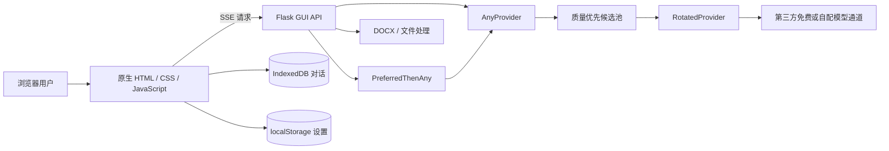

# TomGPT

> 免费、本地优先、动态交互的多模型 AI 助手。<br>
> A free, local-first, dynamically interactive multi-model AI assistant.

[中文](#中文说明) · [English](#english) · [用户指南](docs/USER_GUIDE.md) · [架构](docs/ARCHITECTURE.md) · [部署](docs/DEPLOYMENT.md)

TomGPT 是基于 [gpt4free（g4f）](https://github.com/xtekky/gpt4free) 的本地 Web 应用：浏览器端使用原生 HTML、CSS 和 JavaScript，服务端使用 Flask 与 g4f。它聚合多个模型通道，以质量优先的顺序尝试免费匿名服务，并在可行时自动切换故障通道。

TomGPT 本身免费，不要求购买 SDK，也不把对话默认上传到 TomGPT 自有云端。但模型回答仍来自独立的第三方服务；这些服务可能限流、改变模型或停止开放，**不具备永久可用性或 SLA 保证**。

---

## 中文说明

### 为什么使用 TomGPT？

- **本地优先**：服务运行在自己的电脑上；普通对话保存在当前浏览器的 IndexedDB，设置保存在 `localStorage`。
- **免费优先**：默认池和 Free Advanced 路由优先使用无需用户 API Key、付费订阅或交互式登录的第三方通道。
- **自动容错**：`AnyProvider` 按质量层级选择通道，`RotatedProvider` 逐个尝试；手选通道失败时，`PreferredThenAny` 可切回自动池。
- **多模态工作流**：支持图片理解、文档上传、真实图片生成路由、语音输入/朗读及 Word 导出。
- **动态但可控的界面**：流式状态、附件托盘和响应式布局；支持“关闭动画”以及系统 `prefers-reduced-motion`。
- **不伪装成功**：明确的生图意图只会使用图片模型；图片通道失败时不会回退到聊天模型并虚构“已经生成”。

### 能力矩阵

| 能力 | 当前实现 | 重要边界 |
|---|---|---|
| 流式聊天 | Flask SSE + g4f provider | 回答质量和可用性取决于实际通道 |
| 自动换源 | 质量优先池、轮换、短退避重试 | 不能保证所有第三方同时故障时仍成功 |
| 免费高级路由 | `free-advanced`、`free-reasoning`、`free-coding`、`free-multimodal` | 路由中的模型和服务可能随上游变化 |
| 图片理解 | 自动切入视觉池，支持图片附件 | 仅视觉能力真实可用的通道能读取图片 |
| 图片生成 | 生图意图强制 `flux`，仅在图片模型间降级 | 不回退到聊天模型；失败会明确报错 |
| 文件理解 | PDF、DOCX、TXT、Markdown、CSV、XLSX、图片等 | 解析效果取决于格式、依赖和模型上下文 |
| Word 导出 | 服务端生成真实 `.docx` | 需要 `python-docx` |
| 语音 | 浏览器语音识别 + 可用通道的语音合成 | 浏览器支持、权限和外部语音服务均会影响可用性 |
| 手机访问 | 局域网绑定或临时隧道 | 默认无应用级鉴权，不应直接长期暴露公网 |
| 对话存储 | IndexedDB；设置使用 `localStorage` | 清理浏览器数据会删除本地记录；隐私模式不持久 |

### 系统要求

- Python 3.10 或更高版本（建议使用当前受支持的稳定版本）
- `pip` 和 Python 虚拟环境
- 现代 Chromium、Firefox 或 Safari 浏览器
- 可访问所选第三方 AI 通道的网络
- Node.js 仅在运行前端意图测试时需要

### 快速开始

```bash
git clone https://github.com/Tomhao10225101490/TomGPT.git
cd TomGPT
python3 -m venv .venv
source .venv/bin/activate
python -m pip install --upgrade pip
python -m pip install -r requirements.txt
python start_tomgpt.py
```

Windows PowerShell 激活虚拟环境：

```powershell
.\.venv\Scripts\Activate.ps1
```

打开 <http://127.0.0.1:8080/chat/>。默认只监听本机回环地址。

常用启动参数：

```bash
# 局域网访问；请配合操作系统防火墙并仅在可信网络使用
python start_tomgpt.py --host 0.0.0.0 --port 8080

# 调试日志；不要把日志中的敏感信息公开
python start_tomgpt.py --debug
```

也可以使用上游 CLI 入口：

```bash
python -m g4f.cli gui --port 8080 --debug
```

### 免费高级模型

当前代码中的精选路由如下；这描述的是**路由候选**，不是可用性承诺：

| 路由 | 当前候选 |
|---|---|
| `free-advanced` | Qwen `qwen3.7-plus` → CopilotApp `smart` → Pollinations `gpt-oss` |
| `free-reasoning` | CopilotApp `reasoning` → Qwen `qwen3.7-plus` → Pollinations `gpt-oss` |
| `free-coding` | Qwen `qwen3-coder-plus` → Pollinations `kimi-code` |
| `free-multimodal` | Qwen `qwen3.5-omni-plus` → OperaAria `aria` |

还注册了 `qwen-3.7-plus`、`qwen-3.7-max`、`qwen-3-coder-plus`、`qwen-3.5-omni-plus`、`gpt-oss-20b`、`llama-3.3-70b`、`kimi-k2.7-code` 和 `glm-5.2` 等规范模型名。单通道路由只有一个实际后端时，不应理解为高可用池。

### How does the whole architecture work? / 整体架构如何工作？



一次聊天会从浏览器打包消息和附件，经 `/backend-api/v2/conversation` 进入 Flask。服务端解析模型/通道后，自动路由会过滤不适合的候选、按认证需求、浏览器交互需求、质量层级和实时健康分排序，再由 `RotatedProvider` 依次流式请求。内容通过 SSE 返回，前端实时渲染并更新浏览器本地对话。

完整请求生命周期、failover、意图路由、API、安全边界和 Mermaid 时序图见 [架构说明](docs/ARCHITECTURE.md)。

### 项目结构

```text
TomGPT/
├── g4f/                         # Python 核心、模型、provider 与 Flask GUI 服务
│   ├── Provider/                # 具体第三方通道适配器
│   ├── providers/               # AnyProvider、轮换和 TomGPT failover
│   ├── gui/server/              # Flask 页面与 backend-api
│   └── tools/export_docx.py     # Word 文档生成
├── g4f.dev/
│   ├── chat/index.html          # 聊天页面
│   └── dist/                    # 原生 CSS / JavaScript / 图片资源
├── etc/unittest/                # Python 单元测试
├── docs/                        # 用户、架构与部署文档
├── requirements.txt             # 完整运行依赖
└── start_tomgpt.py              # 本地启动入口
```

### 文档

- [用户指南 / User Guide](docs/USER_GUIDE.md)：安装、聊天、模型、识图、生图、Word、语音、手机访问、设置与 FAQ。
- [架构 / Architecture](docs/ARCHITECTURE.md)：请求生命周期、模型路由、failover、动态 UI、存储、API、测试与安全边界。
- [部署 / Deployment](docs/DEPLOYMENT.md)：本地、LAN、临时 Cloudflare Tunnel 与生产化建议。

### 测试

```bash
python -m etc.unittest
node g4f.dev/dist/js/tomgpt-intents.test.js
```

本次发布验证：Python 套件实际运行 **206 项并全部通过，16 项跳过**；前端意图测试 **12/12 通过**；`git diff --check` 通过。跳过数会随可选依赖和平台能力变化，请以当前命令输出为准。

### 免费意味着什么？

TomGPT 源代码免费并使用 GPL-3.0；默认路径不要求付费 SDK。这里的“免费”不代表第三方计算资源由 TomGPT 永久提供，也不代表第三方服务没有自己的条款、额度、地区限制或未来收费策略。自动换源能提高可用性，但无法创造永久 SLA。

### FAQ

#### 为什么模型偶尔会变慢或失败？

匿名第三方服务可能限流、排队、改版或临时下线。TomGPT 会尝试其他候选；如果整个池都不可用，请稍后重试或配置自己有权使用的通道。

#### 对话真的只在本地吗？

对话历史由当前浏览器的 IndexedDB 保存，设置由 `localStorage` 保存；但是你发送给模型的消息和附件必须传给所选第三方服务才能生成回答。TomGPT 不应被理解为离线大模型。

#### 能否把 `0.0.0.0:8080` 直接开放到公网？

不建议。当前启动方式使用 Flask 开发服务器，而且 TomGPT 没有实现完整的应用级用户认证、租户隔离和滥用防护。请阅读[部署指南](docs/DEPLOYMENT.md)。

#### 为什么生图失败后没有普通文字回答？

这是刻意的真实性保护：明确生图请求只在真实图片模型之间尝试，所有图片通道失败后会报错，而不是让聊天模型假装生成了图片。

更多问题见[用户指南 FAQ](docs/USER_GUIDE.md#常见问题--faq)。

### 贡献、许可与上游归属

欢迎通过 issue 或 pull request 提交可复现的缺陷、测试和文档改进。提交前请运行 Python 与 JavaScript 测试，且不要提交 API Key、cookie、HAR、访问令牌、个人路径或生成媒体。

本项目遵循仓库中的 [GNU GPL-3.0](LICENSE)。TomGPT 是基于上游 [xtekky/gpt4free](https://github.com/xtekky/gpt4free) 和 [gpt4free/g4f.dev](https://github.com/gpt4free/g4f.dev) 的衍生工作；第三方名称和商标归各自所有。使用者应遵守服务条款及所在地法律。

---

## English

TomGPT is a local Web application built on [gpt4free (g4f)](https://github.com/xtekky/gpt4free). Its frontend is vanilla HTML/CSS/JavaScript; its backend combines Flask with g4f's provider ecosystem. It tries anonymous, no-user-key routes in stable quality-first order and automatically moves to another candidate when possible.

### What makes TomGPT useful?

- **Local-first state:** normal conversations live in this browser's IndexedDB; preferences live in `localStorage`.
- **Free-first routing:** the default and Free Advanced pools prioritize routes that require no user API key, paid SDK, or interactive login.
- **Failure-aware streaming:** `AnyProvider`, `RotatedProvider`, and `PreferredThenAny` handle selection, rotation, fresh-session retries, and preferred-provider fallback.
- **Multimodal workflows:** vision, document upload, real image routing, voice interaction, and server-generated Word files.
- **Honest image generation:** explicit image requests stay on image models. A failed image pool never falls back to chat text that falsely claims an image was created.
- **Accessible motion controls:** dynamic streaming states with a no-animation option and reduced-motion support.

### Quick start

```bash
git clone https://github.com/Tomhao10225101490/TomGPT.git
cd TomGPT
python3 -m venv .venv
source .venv/bin/activate
python -m pip install --upgrade pip
python -m pip install -r requirements.txt
python start_tomgpt.py
```

Open <http://127.0.0.1:8080/chat/>.

For a trusted LAN only:

```bash
python start_tomgpt.py --host 0.0.0.0 --port 8080
```

### How does the whole architecture work? / 整体架构如何工作？

The browser sends messages and attachments to the Flask SSE endpoint. The backend resolves the requested model/provider, filters unsuitable candidates, sorts the pool by authentication needs, browser-interaction needs, stable quality tier, and live health, then streams the first successful provider response back. IndexedDB keeps normal conversation history locally; `localStorage` keeps UI preferences. See [Architecture](docs/ARCHITECTURE.md) for diagrams and exact boundaries.

### Free-service boundary

TomGPT itself is free software and does not require a paid SDK on its default path. Third-party anonymous services are independent systems: they can rate-limit, change models, add authentication, restrict regions, or disappear. Automatic switching improves resilience; it does **not** provide a permanent SLA.

### Documentation

- [User Guide — bilingual](docs/USER_GUIDE.md)
- [Architecture — bilingual](docs/ARCHITECTURE.md)
- [Deployment — bilingual](docs/DEPLOYMENT.md)

### FAQ

#### Is TomGPT an offline model?

No. The UI and its state are local, but prompts and attachments must reach the selected external provider to produce an answer.

#### Is it safe to expose the development server publicly?

No. The local Flask development server and current no-auth application boundary are not suitable for a long-lived public deployment. Follow the [deployment guidance](docs/DEPLOYMENT.md).

#### Is every listed model always available?

No. The list represents configured routes and discoverable models, not a guarantee that every independent provider is healthy at any moment.

### License and attribution

Licensed under [GNU GPL-3.0](LICENSE). TomGPT is derived from [xtekky/gpt4free](https://github.com/xtekky/gpt4free) and [gpt4free/g4f.dev](https://github.com/gpt4free/g4f.dev). Follow provider terms and applicable law.
