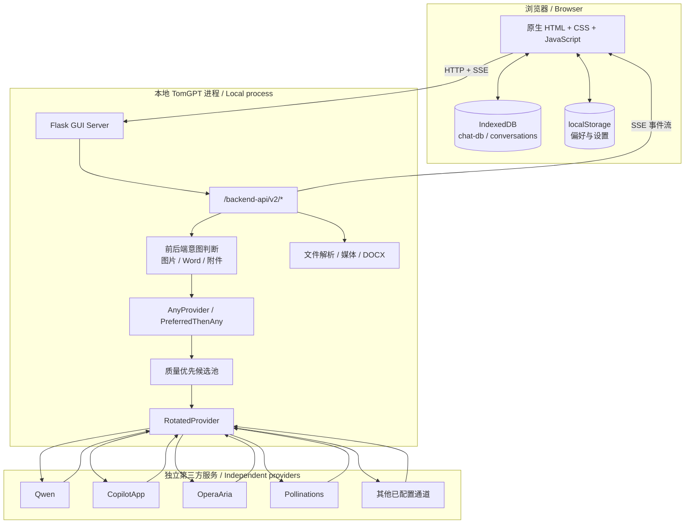
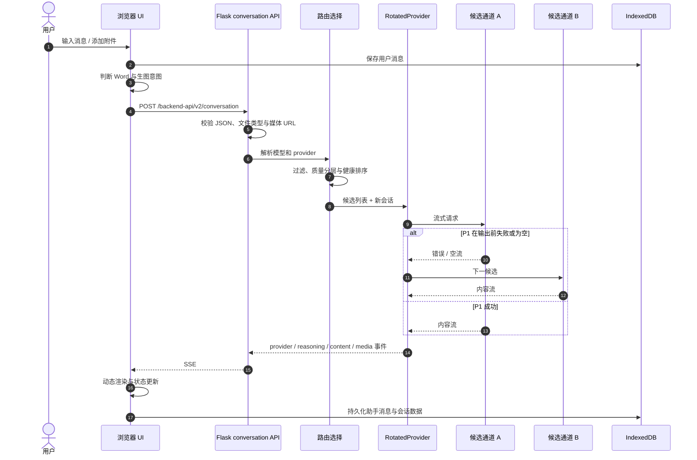

# TomGPT 架构 / Architecture

[中文](#中文架构) · [English](#english-architecture) · [用户指南](USER_GUIDE.md) · [部署](DEPLOYMENT.md) · [返回主页](../README.md)

本文只描述当前仓库中已实现的行为。生产级认证、网关限流、集中数据库和 SLA 等未实现能力会明确标为建议，不会当作现有功能。

---

## 中文架构

## How does the whole architecture work? / 整体架构如何工作？

TomGPT 是一个本地优先的 Web UI 与多通道推理路由层：

- **表现层**：`g4f.dev/chat/index.html`、`g4f.dev/dist/css/`、`g4f.dev/dist/js/`，均为原生 HTML/CSS/JavaScript。
- **Web 服务层**：`g4f/gui/server/` 中的 Flask 应用负责静态页面、文件、模型列表、SSE 对话和 DOCX 导出。
- **模型与路由层**：`g4f/models.py`、`g4f/providers/` 和 `g4f/Provider/` 负责模型注册、候选池、通道选择与协议适配。
- **外部依赖层**：实际推理由独立第三方服务完成；免费匿名通道不是 TomGPT 自有基础设施。
- **本地状态层**：浏览器 IndexedDB 保存普通对话，`localStorage` 保存设置；服务端会为文件、媒体、可选使用统计等使用本地缓存目录。



### 请求生命周期



关键边界：

1. `/backend-api/v2/conversation` 接收 JSON 或包含附件的表单，删除不允许透传的 `proxy`，并仅允许 Custom provider 使用 `base_url`。
2. 上传文件先经过扩展名检查并写入临时文件；远程 `media_url` 经过安全 URL 检查。
3. 响应使用 `text/event-stream`，事件中可包含 provider、推理、内容、媒体、错误和会话状态。
4. 轮换器只有在实际产生内容后才认定成功；空流会降健康分并尝试下一候选。
5. 已经输出部分内容后再失败时，不会把另一模型的答案拼接到同一回复中。

### 模型注册与路由

`g4f/models.py` 提供规范模型注册表和默认池。当前默认聊天池按固定顺序包含：

```text
Qwen → CopilotApp → OperaAria → Pollinations → TeachAnything
```

默认视觉池包含：

```text
Qwen → OperaAria → Pollinations
```

`AnyProvider` 使用 `model_map` 将用户看到的规范模型名映射为 provider 专用别名。例如 `qwen-3.7-plus` 对应 Qwen 的 `qwen3.7-plus`，`kimi-k2.7-code` 对应 Pollinations 的 `kimi-code`。

精选免费能力路由：

| 路由 | provider → 别名 |
|---|---|
| `free-advanced` | Qwen → `qwen3.7-plus`; CopilotApp → `smart`; Pollinations → `gpt-oss` |
| `free-reasoning` | CopilotApp → `reasoning`; Qwen → `qwen3.7-plus`; Pollinations → `gpt-oss` |
| `free-coding` | Qwen → `qwen3-coder-plus`; Pollinations → `kimi-code` |
| `free-multimodal` | Qwen → `qwen3.5-omni-plus`; OperaAria → `aria` |

这些 route 在模块加载及动态 model map 重建后都会重新应用，避免持久化发现数据把需要认证的通道重新放到默认免费入口。

### 质量优先策略

候选排序不是简单随机，也不是只依赖短期成功分：

1. 无 API Key 时，需要认证的通道排后。
2. 可能打开外部浏览器、要求 Turnstile 或登录的通道被过滤或降级。
3. 使用稳定质量层级：Qwen、GLM、CopilotApp、OperaAria 位于首层；Pollinations、TeachAnything、Together 位于下一层。
4. `provider.live` 只在相同排序约束中反映近期成功/失败，不让冷启动弱通道越过质量层。
5. 有用户自配 API Key 时，不再按匿名认证需求排序，但仍避开不必要的浏览器交互并保留质量优先。

这是一种工程启发式，不是模型质量基准。第三方变更后，层级仍需通过测试和实际结果维护。

### Failover 如何工作？

#### `RotatedProvider`

- 逐个调用候选通道。
- 正确解析每个 provider 的模型别名和可选 API Key。
- 有内容才算成功；空响应视为失败。
- provider 会话过期或 `chat_in_progress` 时，先清除该 provider 的会话并用新会话重试一次。
- 输出前失败则尝试下一候选；输出中失败则保留部分内容并结束。
- 成功增加 `live`，失败减少 `live`。

#### `PreferredThenAny`

手动选择单一 provider 后，先使用该 provider。若在产生内容前失败或返回空流：

1. 前端收到“正在自动切换”的软提示。
2. 失败 provider 及其 parent 被加入忽略列表。
3. 使用新会话进入 `AnyProvider`，避免旧会话 ID 污染后续通道。

#### 池级恢复

`AnyProvider` 的候选池整体失败后，会短暂退避 `0.5s`，用健康候选和新会话重试，然后才进入更弱的备用池。视觉请求在必要时可以把消息中的图片部分扁平化为文字占位，再交给聊天通道回答文本上下文；这并不让文本模型“看见”图片。

### 生图意图为什么特殊？

前后端都有中英双语生图意图检测，用于区分：

- “识别/分析这张图” → 视觉理解。
- “生成/画一张图” → 图片生成。
- “生成 Word/报告/代码” → 文本或 DOCX 工作流，不是图片生成。

默认模型收到明确生图请求时会被强制改为 `flux` 并标记 `force_image_gen`。若首个图片池失败，只尝试已注册的 `gpt-image`、`flux-dev`、`sdxl-turbo` 和 `flux` 替代模型。所有图片候选失败后抛出明确错误，**不会进入聊天 fallback**。

该约束用于防止聊天模型生成假的图片链接或声称“图片已生成”。

### Word 导出如何工作？

前端识别导出意图或消息按钮后，整理助手文本并调用：

```text
POST /backend-api/v2/export/docx
Content-Type: application/json
```

服务端校验非空内容、安全处理文件名，并通过 `g4f/tools/export_docx.py` 与 `python-docx` 返回 DOCX MIME 类型。现有实现是文档生成接口，不是模型凭空创建附件。

### 前端动态 UI

前端没有 React、Vue 或其他组件框架。主要状态由 DOM、原生事件、Web Worker fetch、IndexedDB 和 `localStorage` 协同：

- 流式 fetch 可以在 Web Worker 中进行，失败时回落到主线程 `fetch`。
- 消息具有发送、流式、完成、失败和自动切换等视觉状态。
- 附件托盘在发送前快照文件，发送后清理预览对象 URL。
- 停止生成会同时终止主线程控制器和 worker 请求，并清除可能失效的 provider 会话数据。
- Word 意图可直接导出上一条助手回复，避免不必要的新模型调用。
- 静态资源查询版本为 `tomgpt-brand-11`，用于缓存失效。
- `no-animations` 和 `prefers-reduced-motion: reduce` 提供动画关闭/降低动态效果能力。

### 存储模型

| 数据 | 位置 | 生命周期与风险 |
|---|---|---|
| 普通对话 | 浏览器 IndexedDB：`chat-db` / `conversations` | 跟随浏览器站点数据；清理站点或换设备会丢失 |
| 隐私对话 | 页面内存 | 刷新/关闭后不持久 |
| UI 设置 | 浏览器 `localStorage` | 按来源隔离；清理站点数据会丢失 |
| provider 会话引用 | 对话对象的 `data` | 中止或 failover 时主动清除，避免陈旧会话 |
| 临时上传 | 服务端临时/桶目录 | 取决于文件处理和清理路径 |
| 可选使用统计 | cookies 目录下 `.usage/*.jsonl` | 本地文件；仅相关 API 被调用时写入 |
| 分享聊天 | 服务端 bucket 中 `chat.json` | 使用分享接口时写入，不等于默认对话同步 |

因此“本地对话”准确含义是浏览器本地持久化，而不是所有数据都放在 `localStorage`，也不是请求永远不离开设备。

### 主要 API

| 路径 | 方法 | 作用 |
|---|---|---|
| `/backend-api/v2/models` | GET | 聚合模型列表 |
| `/backend-api/v2/models/<provider>` | GET | 单 provider 模型列表 |
| `/backend-api/v2/providers` | GET | provider 信息 |
| `/backend-api/v2/conversation` | POST | 主 SSE 对话入口 |
| `/backend-api/v2/files/<bucket_id>` | GET/POST/DELETE | 文件桶操作 |
| `/backend-api/v2/files/<bucket_id>/stream` | GET | 文件处理事件流 |
| `/backend-api/v2/export/docx` | POST | Word 导出 |
| `/backend-api/v2/synthesize/<provider>` | POST | 可用 provider 的语音合成 |
| `/backend-api/v2/usage` | POST | 可选使用记录 |
| `/backend-api/v2/stats` | GET | 本地使用统计汇总 |
| `/backend-api/v2/chat/<share_id>` | GET/POST | 显式分享数据读写 |

这不是稳定的公共 API 合约；对外集成应优先参考 g4f API 文档并固定兼容版本。

### 测试结构

`python -m etc.unittest` 汇集上游核心测试以及 TomGPT 专项测试：

- `tomgpt_intent.py`：中英生图意图和误判保护。
- `tomgpt_failover.py`：单通道到自动池的故障切换。
- `tomgpt_export_docx.py`：真实 DOCX 与安全文件名。
- `tomgpt_default_pool.py`：默认匿名池和顺序。
- `tomgpt_free_models.py`：精选免费 route、别名与能力注册。

`node g4f.dev/dist/js/tomgpt-intents.test.js` 验证浏览器侧 Word/图片意图。本次发布环境实际运行 Python **206 项并全部通过，16 项跳过**；JavaScript 意图测试 **12/12 通过**；`git diff --check` 通过。跳过数取决于可选依赖与平台。测试通过不等于第三方在线通道始终健康；单元测试主要验证本地逻辑。

### 部署边界

`start_tomgpt.py` 调用 g4f GUI，并默认监听 `127.0.0.1:8080`。绑定 `0.0.0.0` 只改变网络可达性，不会自动增加认证、TLS、限流或审计。

当前 Flask GUI：

- 没有面向公网多用户场景的完整登录和授权。
- 没有承诺完整的 CSRF、防滥用、租户隔离和请求配额边界。
- Flask 开发服务器不应作为长期公网生产服务器。
- provider 内容和附件会离开本机并进入实际第三方服务。

生产化建议见[部署文档](DEPLOYMENT.md)，这些建议不代表仓库已经实现。

### 安全边界与威胁

1. **凭据**：环境变量、cookie 文件、HAR 和 provider token 可能授予外部账号权限；不得提交版本库。
2. **提示与附件**：第三方 provider 能看到其处理的请求；不要上传不允许离开设备的数据。
3. **不受信内容**：模型输出和上传文件都应视为不受信输入；前端渲染和后端文件处理必须保持过滤。
4. **SSRF/路径**：媒体 URL 需安全检查，文件名需规范化；新增端点不能绕过这些保护。
5. **公开服务**：无鉴权公网暴露会允许陌生人消耗网络、provider 配额和本地资源。
6. **依赖链**：g4f provider 适配外部页面和非稳定接口；更新依赖前应审查变更并重新测试。
7. **可用性**：自动 failover 是韧性机制，不是安全机制，也不是 SLA。

---

## English Architecture

## How does the whole architecture work? / 整体架构如何工作？

TomGPT consists of a vanilla browser UI, a local Flask/g4f backend, a routing layer, and independent external providers.

1. The browser stores normal conversations in IndexedDB and preferences in `localStorage`.
2. It submits prompts and attachments to `/backend-api/v2/conversation`.
3. Flask validates the request, resolves the provider/model, and returns an SSE response.
4. `AnyProvider` creates and sorts a candidate pool; `RotatedProvider` attempts candidates until content is produced.
5. A manually selected provider is wrapped by `PreferredThenAny`, which can enter the automatic pool if the preferred route fails before output.
6. SSE events update the dynamic DOM and the local conversation record.

### Routing and resilience

The default chat pool is Qwen, CopilotApp, OperaAria, Pollinations, and TeachAnything. The vision pool is Qwen, OperaAria, and Pollinations. Candidate ordering considers authentication, browser interaction, a stable quality tier, and recent health.

The four curated capability routes are:

- `free-advanced`: Qwen `qwen3.7-plus`, CopilotApp `smart`, Pollinations `gpt-oss`.
- `free-reasoning`: CopilotApp `reasoning`, Qwen `qwen3.7-plus`, Pollinations `gpt-oss`.
- `free-coding`: Qwen `qwen3-coder-plus`, Pollinations `kimi-code`.
- `free-multimodal`: Qwen `qwen3.5-omni-plus`, OperaAria `aria`.

These definitions improve selection; they do not guarantee external uptime.

`RotatedProvider` treats empty streams as failures, drops stale provider conversation state, retries known stale-session errors once with a fresh session, and rotates before any content starts. Once content has started, it preserves the coherent partial answer instead of stitching another model into the same response.

### Intent routing

Chinese and English heuristics distinguish image recognition, image generation, and document/Word requests. An explicit image-generation request on the default model forces `flux`. If it fails, only registered image alternatives are considered. Chat fallback is prohibited for this path so the system cannot falsely claim that an image was generated.

Word export is similarly concrete: the browser calls `/backend-api/v2/export/docx`, and the backend returns bytes generated through `python-docx`.

### Dynamic frontend and storage

The frontend is vanilla HTML/CSS/JavaScript. It uses direct DOM state, a worker-assisted streaming fetch with main-thread fallback, attachment snapshots, abort handling, and local browser persistence. Static asset URLs use the `tomgpt-brand-11` cache marker. Motion can be disabled explicitly or reduced through `prefers-reduced-motion`.

Normal conversations are in IndexedDB, not literally in `localStorage`; preferences are in `localStorage`. Private conversations remain in memory. Optional server features can write files, media, usage JSONL, and explicitly shared chat data to local backend directories.

### API and security boundary

The Flask GUI exposes model/provider discovery, SSE conversation, file, media, synthesis, DOCX, usage, and explicit share endpoints. It is an application-internal interface, not a promised stable public contract.

The default local bind is appropriate for personal use. Binding to `0.0.0.0` does not add authentication, TLS, rate limiting, CSRF protection, tenant isolation, or abuse controls. The Flask development server and current application boundary are not suitable for a long-lived public deployment.

Prompts and attachments leave the device when an external provider processes them. Credentials, cookies, HAR files, model output, remote media, and uploaded documents must all be handled as sensitive or untrusted data according to their role.

### Testing

Python tests cover the upstream core plus TomGPT intent, failover, DOCX, default-pool, and free-route behavior. The Node test covers browser-side image/Word intent. `git diff --check` detects whitespace defects.

In this release environment, all 206 executed Python tests passed with 16 skips; all 12 JavaScript intent cases passed, and `git diff --check` passed. Skip counts are environment-dependent. These tests validate local logic; they cannot guarantee the future health, terms, or model identity of independent anonymous services.

For operational topology and production recommendations, see [Deployment](DEPLOYMENT.md).
