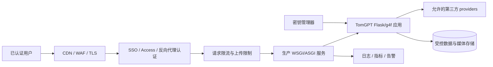

# TomGPT 部署指南 / Deployment Guide

[中文](#中文部署指南) · [English](#english-deployment-guide) · [用户指南](USER_GUIDE.md) · [架构](ARCHITECTURE.md) · [返回主页](../README.md)

> 关键结论：`python start_tomgpt.py` 启动的是适合开发和个人使用的 Flask GUI。公网绑定前必须设置访问密码；应用已内置按 IP 限流。TLS、反代与完整多用户体系仍需额外配置。

---

## 中文部署指南

### 部署方式对比

| 方式 | 适用场景 | 网络范围 | 当前安全判断 |
|---|---|---|---|
| 本机 `127.0.0.1` | 个人使用、开发、测试 | 仅本机 | 推荐默认；密码可选 |
| 局域网 / 公网 `0.0.0.0` | 他人访问、上线 | 局域网或公网 | **必须**设置访问密码；已内置按 IP 限流 |
| 临时 Cloudflare Tunnel | 临时远程演示、短时自用 | 公网 URL | 必须设密码；仍建议命名 Tunnel + Access |
| 生产部署 | 长期、多用户、互联网访问 | 公网 | 密码 + 限流 + TLS/反代；仍非完整多租户体系 |

### 0. 上线前必做：访问密码与限流

TomGPT 已内置：

1. **共享访问密码**（HTTP Basic / Bearer / `g4f-api-key`）
2. **按 IP 限流**（对话更严、全站更宽）
3. **非本机绑定强制密码**：`--host 0.0.0.0` 且未设密码时会拒绝启动

公网上线示例：

```bash
export TOMGPT_PASSWORD='换成足够长的随机密码'
export TOMGPT_RATE_LIMIT='20/60'          # 每 IP 每 60 秒最多 20 次对话类请求
export TOMGPT_RATE_LIMIT_GLOBAL='180/60'  # 每 IP 每 60 秒最多 180 次普通请求
export TOMGPT_TRUST_PROXY='true'          # 仅在受信 Nginx/Caddy/Cloudflare 后开启
python start_tomgpt.py --host 0.0.0.0 --port 8080 --trust-proxy
```

或：

```bash
python start_tomgpt.py --host 0.0.0.0 --port 8080 \
  --password '换成足够长的随机密码' \
  --rate-limit 20/60 \
  --rate-limit-global 180/60 \
  --trust-proxy
```

浏览器会弹出登录框：用户名可随意填写，密码为上面设置的值。也可使用：

- `Authorization: Bearer <password>`
- 请求头 `g4f-api-key: <password>`

关闭限流（不推荐公网）：`TOMGPT_RATE_LIMIT=off` 与 `TOMGPT_RATE_LIMIT_GLOBAL=off`。

说明：这是上线最低防护，不能替代 Cloudflare Access、完整账号体系或多租户隔离。`TOMGPT_TRUST_PROXY=true` 仅在你信任反代、且反代会覆盖伪造的 `X-Forwarded-For` 时开启。

### 1. 本机部署

```bash
python3 -m venv .venv
source .venv/bin/activate
python -m pip install -r requirements.txt
python start_tomgpt.py
```

访问 <http://127.0.0.1:8080/chat/>。

默认 `127.0.0.1` 不接受其他设备的连接，是当前最小暴露面。仍应注意：模型请求会发送到实际第三方 provider；“本机部署”不代表“离线模型”。

### 2. 局域网部署

```bash
python start_tomgpt.py --host 0.0.0.0 --port 8080
```

在同一可信网络的设备打开：

```text
http://<服务器局域网IP>:8080/chat/
```

最低安全要求：

- 只在家庭或受管控的可信网络使用，避免访客网络。
- 操作系统防火墙仅允许必要网段访问 8080。
- 服务器停止使用后立即关闭进程。
- 不在共享设备中保存 provider token、cookie 或敏感对话。
- 不进行路由器公网端口映射。

`0.0.0.0` 的含义只是“监听所有网络接口”，不是加密、认证或授权。

### 3. 临时 Cloudflare Tunnel

Cloudflare Quick Tunnel 可以把本地端口临时映射为公网 HTTPS URL。它适合短时演示，不适合长期公开。

安装 `cloudflared` 后，示例命令：

```bash
TOMGPT_PASSWORD='your-strong-password' python start_tomgpt.py --host 127.0.0.1 --port 8080
cloudflared tunnel --url http://127.0.0.1:8080
```

注意：

- 临时 URL 是敏感访问入口，不要写入 README、Git、issue、日志截图或固定配置。
- 即使有应用密码，也不要把 Quick Tunnel URL 当长期主页。
- 如果必须远程访问，优先使用命名 Tunnel + Cloudflare Access（身份提供商、允许名单、短会话），并限制来源。
- Tunnel 只解决传输与可达性；应用密码与限流是最低门槛，仍不覆盖完整 CSRF、多用户隔离与 provider 配额治理。
- 使用结束后停止 `cloudflared` 与 TomGPT 进程。

不要把临时隧道 URL设为 GitHub homepage。

### 4. 为什么仍不能把它当成完整生产多用户系统？

当前启动入口使用 g4f GUI 的 Flask 服务路径，面向本地/轻量部署。即使没有显式开启 `--debug`，也不应把开发服务理解为完整生产 WSGI 栈。

已内置共享访问密码与按 IP 限流，但仓库仍没有完整实现：

- 多用户账号、多因素认证和细粒度授权。
- 完整的 CSRF、安全会话和跨租户隔离策略。
- 按用户的配额、上传额度与滥用检测。
- 统一 TLS、HSTS、CSP 和安全响应头策略。
- provider 凭据保险库、密钥轮换和审计。
- 持久数据库迁移、备份、恢复和数据保留策略。
- 多进程任务协调、队列、健康检查和滚动发布。
- 结构化监控、告警、追踪和事故响应。

因此不能声称 TomGPT 已经生产就绪。

### 5. 合理的生产化拓扑

下面是建议架构，不是现有实现：



建议的实施顺序：

1. **定义威胁模型和数据分类**：谁可以访问、哪些提示/附件允许发送给第三方、保留多久。
2. **增加边缘 TLS 与强制身份认证**：例如受控反向代理或 Cloudflare Access；不要只靠秘密 URL。
3. **使用生产 WSGI/ASGI 容器**：根据 Flask/g4f 的异步与流式兼容性，评估 Gunicorn、Waitress 或 ASGI 适配器；先做 SSE/长连接压测。
4. **增加限流和资源上限**：按用户/IP 限制请求、并发、文件大小、总存储和 provider 用量。
5. **隔离凭据**：服务端密钥管理器、最小权限、定期轮换；不允许浏览器读取全局 provider 密钥。
6. **持久化设计**：若从浏览器本地对话迁移到服务器数据库，先实现租户隔离、加密、删除和导出策略。
7. **加强文件管线**：MIME 验证、杀毒/沙箱、解压炸弹保护、超时、临时文件清理和内容安全策略。
8. **可观测性**：记录请求 ID、错误类别、延迟和 provider 切换，不记录原始密钥或默认记录完整敏感提示。
9. **更新策略**：固定依赖、生成 SBOM、扫描漏洞、审查上游 provider 变更，并保留回滚方案。

### 6. 反向代理最低要求

若在受控环境使用 Nginx、Caddy 或同类代理，应至少考虑：

- 正确支持 SSE：关闭不合适的响应缓冲，设置足够的读取超时。
- 设置请求体和上传大小上限。
- TLS 终止和 HTTP 到 HTTPS 重定向。
- 认证在请求进入 TomGPT 前完成。
- 限制 `/backend-api/`、文件、统计和分享端点的访问。
- 不缓存个性化 SSE、私有文件或包含敏感数据的响应。
- 转发可信代理头时配置明确的受信代理列表，避免客户端伪造。

具体配置依赖环境，仓库没有提供一份可直接声称安全的通用生产配置。

### 7. 容器部署边界

仓库包含 Docker Compose 文件，但容器化本身不等于生产化。使用前检查：

- 映射端口是否意外绑定所有公网接口。
- volume 中是否包含 cookie、HAR、API Key、聊天或生成媒体。
- 容器是否以非 root 用户运行。
- 文件系统和临时目录是否有配额及清理策略。
- 镜像依赖是否固定、扫描并来自可信构建。
- 重启策略会不会导致无限调用第三方 provider。

不要把 `.env` 烘焙到镜像，也不要把运行时 cookie volume 提交到 Git。

### 8. 发布前检查清单

- [ ] 默认入口仍绑定 `127.0.0.1`；公网改用 `0.0.0.0` 时已设置 `TOMGPT_PASSWORD`。
- [ ] 公网访问前有强制认证（应用密码和/或 Cloudflare Access）与 TLS。
- [ ] 已确认 `TOMGPT_RATE_LIMIT` / `TOMGPT_RATE_LIMIT_GLOBAL` 适合预期流量。
- [ ] 明确允许的用户、provider、模型和数据类型。
- [ ] 限制并发、上传大小和磁盘使用。
- [ ] 秘密不在代码、镜像、日志、浏览器包或 Git 历史中。
- [ ] Python 与 JavaScript 测试通过。
- [ ] SSE、停止生成、failover、上传和 DOCX 经真实环境验证。
- [ ] 备份、恢复、日志保留和删除策略已演练。
- [ ] 外部服务条款允许当前使用方式。
- [ ] 监控和事故联系人已配置。

---

## English Deployment Guide

### Deployment modes

| Mode | Intended use | Assessment |
|---|---|---|
| Local `127.0.0.1` | Personal use and development | Recommended default; password optional |
| LAN / public `0.0.0.0` | Shared or public access | **Requires** access password; per-IP rate limits enabled |
| Temporary Cloudflare Tunnel | Short remote demo or personal session | Password required; prefer named Tunnel + Access |
| Long-lived public service | Multi-user Internet deployment | Password + rate limits + TLS/proxy; still not full multi-tenant |

### Access password and rate limits (required before public launch)

TomGPT includes a shared access password (HTTP Basic / Bearer / `g4f-api-key`), per-IP rate limits, and a non-loopback bind guard that refuses `--host 0.0.0.0` without a password.

```bash
export TOMGPT_PASSWORD='use-a-long-random-password'
export TOMGPT_RATE_LIMIT='20/60'
export TOMGPT_RATE_LIMIT_GLOBAL='180/60'
export TOMGPT_TRUST_PROXY='true'   # only behind a trusted reverse proxy
python start_tomgpt.py --host 0.0.0.0 --port 8080 --trust-proxy
```

Browser Basic Auth: username can be anything; password is the shared secret. This is a minimum gate, not a full account system.

### Local

```bash
python3 -m venv .venv
source .venv/bin/activate
python -m pip install -r requirements.txt
python start_tomgpt.py
```

Open <http://127.0.0.1:8080/chat/>. Local hosting still sends prompts and required attachments to the selected external provider.

### Trusted LAN

```bash
python start_tomgpt.py --host 0.0.0.0 --port 8080
```

Open `http://<server-lan-ip>:8080/chat/` from another device. Non-loopback binds require `--password` / `TOMGPT_PASSWORD`. Restrict the port to the trusted subnet, avoid guest Wi-Fi, and never configure public router port forwarding without TLS and a password.

### Temporary Cloudflare Tunnel

After installing `cloudflared`:

```bash
python start_tomgpt.py --host 127.0.0.1 --port 8080
cloudflared tunnel --url http://127.0.0.1:8080
```

Treat the generated URL as sensitive. Do not commit it, publish it in documentation, or use it as the repository homepage. Always set `TOMGPT_PASSWORD` (or `--password`) even for Quick Tunnels. Prefer a named tunnel protected by Cloudflare Access and an explicit allowlist for any necessary remote access.

A tunnel does not replace TLS edge policy, CSRF/session hardening, upload abuse controls, provider-quota governance, or tenant isolation. Stop both processes after the temporary session.

### Why is the current server not a full public production server?

The current Flask GUI is designed for local development and personal use. Shared password + per-IP rate limits are now built in, but this repository still does not provide a complete public multi-user boundary for:

- per-user accounts, MFA, and fine-grained authorization;
- CSRF/session hardening and tenant isolation;
- durable abuse detection, quotas, and provider-budget accounting;
- comprehensive TLS and security-header policy;
- secret vaulting, rotation, and audit;
- durable database migration, backup, retention, and recovery;
- production worker coordination and rolling deployment;
- monitoring, alerting, tracing, and incident response.

Containerization or a tunnel does not create those controls.

### Recommended production direction

The following are recommendations, not implemented claims:

1. Define users, data classes, provider policies, and retention.
2. Put TLS, WAF, and mandatory identity at the edge.
3. Evaluate a production WSGI/ASGI runtime with SSE and long-request load tests.
4. Enforce request, concurrency, upload, storage, and provider-usage limits.
5. Keep provider credentials in a least-privilege server-side secret manager.
6. Design tenant-safe persistence before moving browser-local conversations to a server database.
7. Sandbox and scan uploads; enforce MIME, size, decompression, timeout, and cleanup limits.
8. Collect request IDs, latency, error classes, and failover metrics without logging secrets or sensitive prompts by default.
9. Pin and scan dependencies, review upstream changes, and maintain rollback procedures.

### Reverse proxy requirements

A controlled reverse proxy should support unbuffered SSE, long read timeouts, upload limits, TLS, mandatory authentication, endpoint-specific access controls, and no caching of private streams/files. Trust forwarded headers only from explicitly configured proxies.

There is no universal proxy snippet in this repository that should be represented as production-safe without environment-specific review.

### Pre-release checklist

- [ ] Local default remains bound to `127.0.0.1`.
- [ ] Public traffic requires TLS and authentication.
- [ ] Users, providers, models, and allowed data are documented.
- [ ] Request, concurrency, upload, and disk limits are enforced.
- [ ] No secret exists in source, images, logs, browser assets, or Git history.
- [ ] Python and JavaScript tests pass.
- [ ] SSE, abort, failover, upload, and DOCX paths are exercised.
- [ ] Backup, restore, retention, and deletion are tested.
- [ ] External provider terms permit the intended use.
- [ ] Monitoring and incident ownership are defined.
